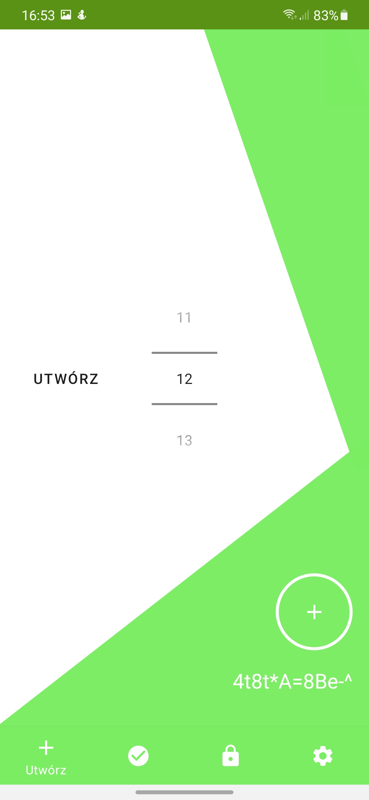
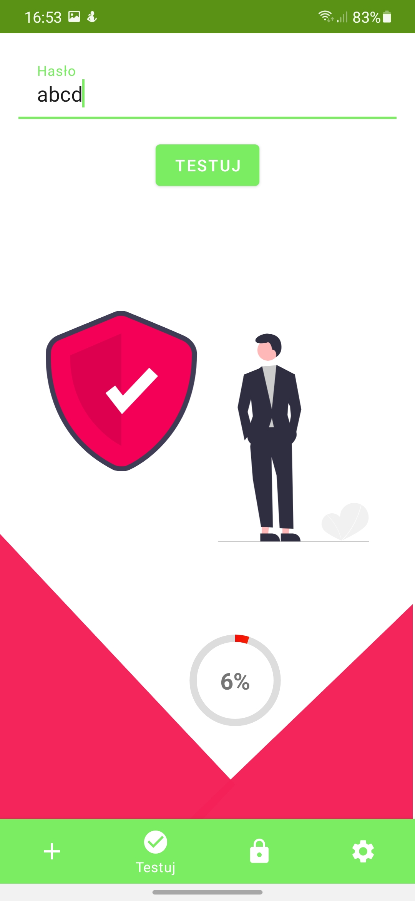
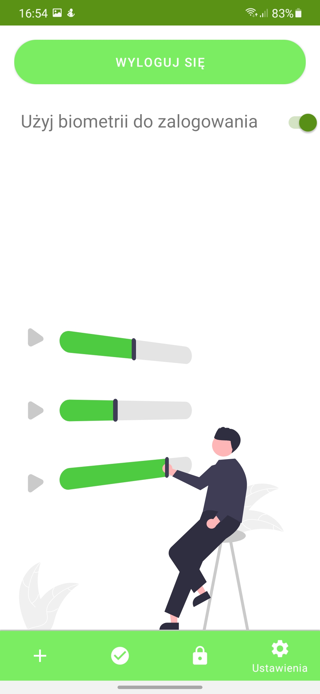

# Passwordgenerator

### Table of contents
* [Project description](#project-description)
* [How to use it?](#how-to-use-it)

### Project description

In this app user can create password and save it or test password to see if it's strong.

### How to use it?

#### Logging screen:

User have to log in using password or biometric authentication to use app.

#### Create password screen

User can specify how long is password and then create it

#### Test password screen

To test password user have to provide password and then press the button

#### Settings screen

In settings screen user can enable biometric authentication and log out.

