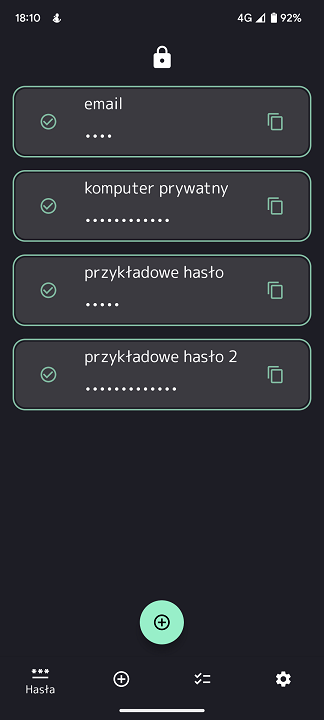

# Password Manager

<b>Android application for storing, generating and testing passwords. Passwords are encrypted and stored in local database. User is also allowed to export and import passwords (exported passwords can be additionally encrypted with password provided by the user).</b>

### Table of contents
* [Where to find latest version](#where-to-find-latest-version)
* [Supported Android versions](#supported-android-versions)
* [Tech stack](#tech-stack)
* [Architecture and modularization](#architecture-and-modularization)
* [Plans for future](#plans-for-future)
* [App design](#app-design)

### Where to find latest version

Application is available on Google play store under this [link](https://play.google.com/store/apps/details?id=com.mateuszholik.passwordgenerator).

### Supported Android versions

Application is available for devices with at least Android 11 version.

### Tech stack

* Kotlin
* Asynchronous tasks - [RxJava](https://github.com/ReactiveX/RxJava)
* Dependency Injection - [Koin](https://insert-koin.io/)
* Database - [Room](https://developer.android.com/training/data-storage/room)
* Unit Tests - [JUnit 5](https://junit.org/junit5/), [Mockk](https://mockk.io/)
* Data Encryption - [Jetpack Security](https://developer.android.com/jetpack/androidx/releases/security)
* Logging - [Timber](https://github.com/JakeWharton/timber)
* Animations - [Lottie Animations](https://airbnb.design/lottie/)
* [Firebase Crashlytics](https://firebase.google.com/docs/crashlytics?hl=pl)
* [Leak Canary](https://square.github.io/leakcanary/)

### Architecture and modularization

Password manager is based on the MVVM architecture, repository and use-case patterns. 
There are also five modules to separate specific parts of the app:

* App - Primary module where are placed all ViewModels, Fragments, Activities, resources and code related to Android.
* Data - Module for data management. Database, shared preferences management is placed here.
* Domain - Module that is used as a bridge between Data and App module. App module uses UseCases from Domain module which are calling specific methods from repositories from Data module.
* PasswordValidation - Password validation code was separated and moved to this module. Every type of validation is handled there.
* Cryptography - All code related to encryption and decryption of data is moved here.

### Plans for future

* Logging out if the app is in the background for a longer period of time
* Migration to Material Design 3
* Adding more information about passwords (link to website, custom expiration data, etc.)

### App design

